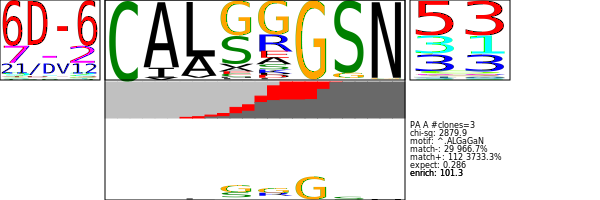
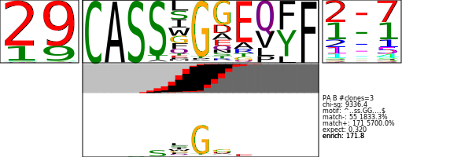

.. _CompleteExample:

Complete Example
================

.. toctree::
   :maxdepth: 2
   :caption: Contents:

Introduction
############

This page illustrates the integration of features within tcrdist2.
There are two major object classes of tcrdist2 that are exposed to the user:

* **TCRrep** :py:class:`tcrdist.repertoire.TCRrep` - specifies metric and computes distances between members of a TCR repertoire

* **TCRsubset** :py:class:`tcrdist.subset.TCRsubset` - analyzes epitope specificity for a specific subset of a TCR repertoire

On this page, rather than delve into the thicket of options available in tcrdist2,
we focus on one instructive example that illustrates the integration of
the program's major features. We reserve more detailed explanations
for separate sections.

.. tip::
  A note on the syntax used in the following coded examples: we instantiate
  instances of **TCRrep**, and **TCRsubset** classes as `tr` and `ts` respectively.

Load tcrdist2
#############

.. code-block:: python

  import os
  import pandas as pd
  import numpy as np
  import tcrdist as td
  
  from tcrdist import mappers
  from tcrdist.repertoire import TCRrep
  from tcrdist.cdr3_motif import TCRMotif
  from tcrdist.subset import TCRsubset
  from tcrdist.storage import StoreIOMotif, StoreIOEntropy
  from tcrdist.plotting import plot_pwm

Example Data
############

This example uses the mouse clones recognizing the PA epitope 
from the Dash et al. 2017 study.

.. tip::
  Information on how to convert tcrdist1 clones files can be found in :ref:`tcrdist1totcrdist2`, 
  and more information on input data format can be found in  :ref:`Inputs`.
  
The file can be downloaded directly (`dash.csv <https://raw.githubusercontent.com/kmayerb/tcrdist2/API2/tcrdist/test_files_compact/dash.csv>`_ 375KB). 

.. code-block:: python

  tcrdist2_df = pd.read_csv("dash.csv")
  tcrdist2_df = tcrdist2_df[tcrdist2_df.epitope == "PA"].copy()

Pairwise Distance
#################

The user can compute TCR distances using a method from the Dash et al. 2016
paper using :py:meth:`tr._tcrdist_legacy_method_alpha_beta()` as is shown in the
following example. However, **tcrdist2** offers a lot of flexibility in the
calculation of "tcrdistances," and the reader is encouraged to consult the
:ref:`PairwiseDistance`, :ref:`QuickStartExample`, and :ref:`DetailedExample`
documentation pages for further details.

The steps in the code block below:

1. Instantiate an instance of TCRrep class as `tr`.
2. Infer CDR1, CDR2, and CDR2.5 sequences based on V and Gene
3. Set index columns. The choice of index columns determines unique clones and also sets which variables remain available to downstream analysis steps.
4. Based on index columns selected, remove duplicates (duplicates are clones identical across all index columns).
5. :py:meth:`tcrdist.repertoire.TCRrep._tcrdist_legacy_method_alpha_beta()` is a convenience function for calculating a legacy TCRdist in the method described by Dash et al. 2017.
6. Save the alpha- and beta-specific distance matrices for later use (motif finding is based on information from a single chain).

.. code-block:: python

  #1
  tr = TCRrep(cell_df = tcrdist2_df, organism = "mouse")

  #2
  tr.infer_cdrs_from_v_gene(chain = 'alpha', imgt_aligned=True)
  tr.infer_cdrs_from_v_gene(chain = 'beta',  imgt_aligned=True)

  #3
  tr.index_cols = ['clone_id', 'subject', 'epitope',
                   'v_a_gene',  'j_a_gene', 'v_b_gene', 'j_b_gene',
                   'cdr3_a_aa', 'cdr3_b_aa',
                   'cdr1_a_aa', 'cdr2_a_aa', 'pmhc_a_aa',
                   'cdr1_b_aa', 'cdr2_b_aa', 'pmhc_b_aa',
                   'cdr3_b_nucseq', 'cdr3_a_nucseq',
                   'va_gene', 'vb_gene',
                   'ja_gene', 'jb_gene']

  #4
  tr.deduplicate()

  #5
  tr._tcrdist_legacy_method_alpha_beta()

  #6
  distA = tr.dist_a
  distB = tr.dist_b
  assert np.all(((distA + distB) - tr.paired_tcrdist) == 0)

.. tip::

  CDR2.5 alpha and CDR2.5 beta, the pMHC-facing loop between CDR2
  and CDR3, are referred to in tcrdist2 as pmhc_a and phmc_b, respectively.

.. tip::
  If using legacy tcrdist, no further weighting is required. See Pairwise
  for information on developing a metric with
  custom weighting each CDR region.

.. _CompleteExampleSubset:

Subset
######

TCRsubset defines a subset of interest. It is common to search for CDR3 motifs
among the subset of the data specific to a single epitope.

The steps in the code block below:

1. Set Some Criteria for the sequences we want to look at.
2. Select subsets of the original distance matrices
3. Instantiate an instance of TCRsubset: `ts`

.. code-block:: python

  # 1
  criteria = tr.clone_df.epitope == "PA"
  clone_df_subset = tr.clone_df[criteria]

  # 2
  distA_subset = distA.loc[clone_df_subset.clone_id, clone_df_subset.clone_id].copy()
  distB_subset = distB.loc[clone_df_subset.clone_id, clone_df_subset.clone_id].copy()

  # 3
  ts = TCRsubset(clone_df_subset,
               organism = "mouse",
               epitopes = ["PA"],
               epitope = "PA",
               chains = ["A","B"],
               dist_a = distA_subset,
               dist_b = distB_subset)

Motifs
######

Search for Motifs
******************

Warning this step can take a long time! Save or serialize results to disk.

.. code-block:: python

  ts.find_motif()

.. tip::
  Under the hood a class called **TCRmotif**
  :py:class:`tcrdist.cdr3_motif.TCRMotif` -
  identifies candidate motifs characteristic of a subset of receptors

If you prefer you can load a previously generated motifs file.

.. code-block:: python

  cnames = ["file_type","count", "expect_random","expect_nextgen", "chi_squared", "nfixed",
  "showmotif", "num", "othernum", "overlap", "ep", "ab",
  "nseqs", "v_rep_counts", "j_rep_counts"]
  motif_fn = 'tcrdist/test_files/mouse_pairseqs_v1_parsed_seqs_probs_mq20_clones_cdr3_motifs_PA.log'
  x = open(motif_fn, "r").readlines()
  ts.motif_df = pd.DataFrame([l.split() for l in x], columns = cnames)

Evaluating and Visualizing Motifs
*********************************

Here is code to plot the first few motif_logos from the TCRsubet.motif_df
DataFrame.

.. code-block:: python

  motif_list = list()
  motif_logos = list()
  for i,row in ts.motif_df.iterrows():
      StoreIOMotif_instance = ts.eval_motif(row)
      motif_list.append(StoreIOMotif_instance)
      motif_logos.append(plot_pwm(StoreIOMotif_instance, create_file = False, my_height = 200, my_width = 600))
      if i > 1:
          break

Here we plot the first of the motif logos stored in motif_logos.

.. tip::
  The underlying data structures used to make these plots can be accessed in
  motif_list. For example, `StoreIOMotif_instance.entropy` contains the
  position-wise matrices. See :py:class:`tcrdist.storage.StoreIOMotif` and
  See :py:class:`tcrdist.storage.StoreIOEntropy` for more details.

.. code-block:: python

  IPython.display.SVG(motif_logos[0])

Without a loop any row of the TCRsubset.motif_df can be plot.
For example, row 87:

.. code-block:: python

  i = 87
  row = ts.motif_df.iloc[i,:].to_dict()
  StoreIOMotif_instance = ts.eval_motif(row)
  svg = plot_pwm(StoreIOMotif_instance, create_file = False, my_height = 200, my_width = 600)
  IPython.display.SVG(svg)

Putting it All Together
#######################

Here is all the code in one place for copying and pasting into your workflow.

.. code-block:: python

  import pandas as pd
  import numpy as np
  import tcrdist as td
  import IPython

  from tcrdist import mappers
  from tcrdist.repertoire import TCRrep
  from tcrdist.cdr3_motif import TCRMotif
  from tcrdist.subset import TCRsubset
  from tcrdist.storage import StoreIOMotif, StoreIOEntropy
  from tcrdist.plotting import plot_pwm

  tcrdist_clone_fn = 'mouse_pairseqs_v1_parsed_seqs_probs_mq20_clones.tsv'
  tcrdist_clone_df = pd.read_csv(tcrdist_clone_fn, sep = "\t")               #1

  ind = (tcrdist_clone_df.epitope == "PA") | (tcrdist_clone_df.epitope == "F2")
  tcrdist_clone_df = tcrdist_clone_df[ind].copy()

  mapping = mappers.tcrdist_clone_df_to_tcrdist2_mapping                     #3
  tcrdist2_df = mappers.generic_pandas_mapper(df = tcrdist_clone_df,         #4
                                            mapping = mapping)

  #1
  tr = TCRrep(cell_df = tcrdist2_df, organism = "mouse")

  #2
  tr.infer_cdrs_from_v_gene(chain = 'alpha', imgt_aligned=True)
  tr.infer_cdrs_from_v_gene(chain = 'beta',  imgt_aligned=True)

  #3
  tr.index_cols = ['clone_id', 'subject', 'epitope',
                 'v_a_gene',  'j_a_gene', 'v_b_gene', 'j_b_gene',
                 'cdr3_a_aa', 'cdr3_b_aa',
                 'cdr1_a_aa', 'cdr2_a_aa', 'pmhc_a_aa',
                 'cdr1_b_aa', 'cdr2_b_aa', 'pmhc_b_aa',
                 'cdr3_b_nucseq', 'cdr3_a_nucseq',
                 'va_countreps', 'ja_countreps',
                 'vb_countreps', 'jb_countreps',
                 'va_gene', 'vb_gene',
                 'ja_gene', 'jb_gene']

  #4
  tr.deduplicate()

  #5
  tr._tcrdist_legacy_method_alpha_beta()

  #6
  distA = tr.dist_a
  distB = tr.dist_b
  assert np.all(((distA + distB) - tr.paired_tcrdist) == 0)

  # 1
  criteria = tr.clone_df.epitope == "PA"
  clone_df_subset = tr.clone_df[criteria]

  # 2
  distA_subset = distA.loc[clone_df_subset.clone_id, clone_df_subset.clone_id].copy()
  distB_subset = distB.loc[clone_df_subset.clone_id, clone_df_subset.clone_id].copy()

  # 3
  ts = TCRsubset(clone_df_subset,
             organism = "mouse",
             epitopes = ["PA"],
             epitope = "PA",
             chains = ["A","B"],
             dist_a = distA_subset,
             dist_b = distB_subset)

  # Do this if you want to find motifs from scratch:
  # ts.find_motif()
  # ts.motif_df.write_csv("ts.motif_df_filesavedfornextime.csv")

  # Do this if you already have a motifs file:
  cnames = ["file_type","count", "expect_random","expect_nextgen", "chi_squared", "nfixed",
  "showmotif", "num", "othernum", "overlap", "ep", "ab",
  "nseqs", "v_rep_counts", "j_rep_counts"]
  motif_fn = 'mouse_pairseqs_v1_parsed_seqs_probs_mq20_clones_cdr3_motifs_PA.log'
  x = open(motif_fn, "r").readlines()
  ts.motif_df = pd.DataFrame([l.split() for l in x], columns = cnames)

  motif_list = list()
  motif_logos = list()
  for i,row in ts.motif_df.iterrows():
    StoreIOMotif_instance = ts.eval_motif(row)
    motif_list.append(StoreIOMotif_instance)
    motif_logos.append(plot_pwm(StoreIOMotif_instance, create_file = False, my_height = 200, my_width = 600))
    if i > 2:
        break

  IPython.display.SVG(motif_logos[0])

  i = 87
  row = ts.motif_df.iloc[i,:].to_dict()
  StoreIOMotif_instance = ts.eval_motif(row)
  svg = plot_pwm(StoreIOMotif_instance, create_file = False, my_height = 200, my_width = 600)
  IPython.display.SVG(svg)
