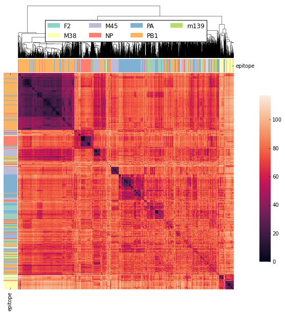
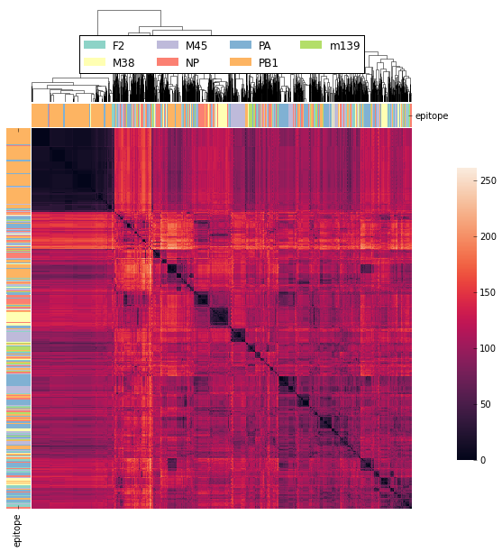
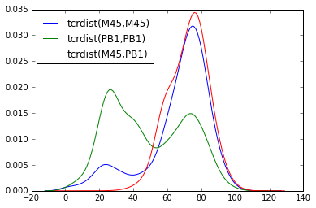

Example 1
=========

The data for this example come from the paper "Quantifiable predictive features
define epitope-specific T cell receptor repertoires" by Dash and colleagues (2017)
`doi:10.1038/nature22383 <https://www.nature.com/articles/nature22383>`_.
The CDR3 alpha and beta sequences and V and J gene usage can be downloaded from the
`vdjDB <https://vdjdb.cdr3.net/search>`_.

Data from this study were selected from the vdjDB using the
search filter (references == PMID:28636592). This query returns data
for 2442 paired alpha/beta T cell receptors
from human and mouse subjects with predicted epitope specificities.

1A: Compute Hamming Distances for Paired Alpha/Beta Chains
----------------------------------------------------------

Data were downloaded as a tab separated flat
file (*vdjDB_PMID28636592.tsv*).

The application programming interface for tcrdist2 involves step-wise
commands using the :py:class:`tcrdist.repertoire.TCRrep` class, which
stores input data, methods, user-parameters, and results.

Before explaining steps and method options in detail, it is useful to present
these steps as a block of code needed to calculate the
'tcrdistances' -- weighted pairwise distance measures based on comparison
across multiple T cell receptor complementarity-determining regions (CDRs) --
between all mouse T cell clones in the Dash et al. 2017 dataset.

Numbered annotations describe each step. We then elaborate on
alternative analysis options.

.. code-block:: python

  import pandas as pd
  import tcrdist as td
  from tcrdist import mappers
  from tcrdist.repertoire import TCRrep

  pd_df = pd.read_csv("vdjDB_PMID28636592.tsv", sep = "\t")      # 1
  t_df = td.mappers.vdjdb_to_tcrdist2(pd_df = pd_df)              # 2
  t_df.organism.value_counts                                      # 3
  index_mus = t_df.organism == "MusMusculus"                      # 4
  t_df_mus = t_df.loc[index_mus,:].copy()                         # 5

  tr = TCRrep(cell_df = t_df_mus, organism = "mouse")             # 6

  tr.infer_cdrs_from_v_gene(chain = 'alpha')                      # 7

  tr.infer_cdrs_from_v_gene(chain = 'beta')                       # 8

  tr.index_cols =['epitope',                                      # 9
                  'subject',
                  'cdr3_a_aa',
                  'cdr1_a_aa',
                  'cdr2_a_aa',
                  'pmhc_a_aa',
                  'cdr3_b_aa',
                  'cdr1_b_aa',
                  'cdr2_b_aa',
                  'pmhc_b_aa']

  tr.deduplicate()                                                # 10

  tr.compute_pairwise_all(chain = "alpha",                        # 11
                          metric = "hamming",
                          processes = 6)

  tr.compute_pairwise_all(chain = "beta",                         # 12
                          metric = "hamming",
                          processes = 6)

  tr.compute_paired_tcrdist(chains = ['alpha','beta'],            # 13
                            replacement_weights= {'cdr3_a_aa_pw': 3,
                                                  'cdr3_b_aa_pw': 3})

Stepwise Explanation
^^^^^^^^^^^^^^^^^^^^

#. Read the .tsv data file into a pandas DataFrame.

#. Call :py:func:`tcrdist.mappers.vdjdb_to_tcrdist2` to select and rename
   the appropriate columns.
   You are encouraged to compare the raw and tcrdist2 formatted inputs

   .. code-block:: python

      pd_df.head()
      t_df.head()

#. Examine instances of human and mouse sequences in the data.

#. Index the sequences that come from MusMusculus (mouse).

#. Create a copy of the subset DataFrame `t_df`, including only mouse TCRs:
   `t_df_mus`.

#. Create an instance of the :py:class:`tcrdist.repertoire.TCRrep` class
   initialized with the `t_df_mus` DataFrame.
    - Upon initialization, the :py:attr:`organism` argument must be set to
      "mouse"
    - The data is now stored as :py:attr:`tcrdist.repertoire.TCRrep.cell_df`.

   .. code-block:: python

      tr.cell_df.head()

#. Use :py:meth:`tcrdist.repertoire.TCRrep.infer_cdrs_from_v_gene` to populate
   CDR1, CDR2 and pMHC loop fields.
    - :py:attr:`chain` argument is set to either 'alpha', 'beta', 'delta', 'gamma'

#. Repeat step 7, with :py:attr:`chain` set to 'beta'.
    - Because of hypermutation occurs in the CDR3 region, the CDR3 sequence
      must be directly supplied. However, for the other complementarity-determining
      regions the sequence come form germline and are not provided in the
      vdjDB data product. Therefore, tcrdist2 uses the predicted v-gene variant
      call (i.e TRAV1-1*01) to infer the amino acid sequence at the remaining
      complementarity-determining regions: CDR1, CDR2, and the pMHC loop positions
      (the pMHC loop is between the CDR2 and CDR3).

#. Specify index columns. Any sequence identical across all the index columns
   will be grouped at the following step. The count field keeps track of
   the number of identical clones (which may occur during clonal expansion)

#. Call :py:meth:`tcrdist.repertoire.TCRrep.deduplicate` to remove duplicates
   and create the :py:attr:`tcrdist.repertoire.TCRrep.clone_df` DataFrame.
   - *Even if there are no duplicates this step is necessary to produce the
   :py:obj:`tcrdist.repertoire.TCRrep.clone_df` DataFrame.*
   - Any row of the DataFrame
   missing any of the CDRs specified in the `index_col` list will not be
   included in the :py:obj:`tcrdist.repertoire.TCRrep.clone_df` DataFrame.
   The :py:obj:`clone_df` data is now stored:

   .. code-block:: python

      tr.clone_df.head()

#. Call :py:meth:`tcrdist.repertoire.TCRrep.compute_pairwise_all` specifying
   the chain, metric, and number of parallel processes to use
    - `chain` argument is set to either 'alpha', 'beta', 'delta', 'gamma'
    - `metric` argument is set to either 'hamming', 'nw' or 'custom' In this
      first example we are using the Hamming Distance, which is the number of
      mismatching positions between two aligned strings. In a later example,
      we will demonstrate how tcrdist2 can incorporate amino acid
      substitution matrices in calculating a distance score.
    - `processes` specified the number of available CPUs.
      tcrdist2 uses python's multiprocessing package to
      parallelize pairwise distance computation.

#. Repeat the previous step setting `chain` argument to 'beta'.

#. Call :py:meth:`tcrdist.repertoire.TCRrep.compute_paired_tcrdist` to compute
   the 'tcrdist'- a weighted sum of the Hamming Distances at each CDR.
    - The argument `replacement_weights`
      takes a dictionary which specifies greater weight on
      sequence differences occurring in certain CDRs.
      (By default all CDRs are weighted equally.)

That's it! If you've followed along you've computed over 2,000,000 tcrdists from
real data in later examples we will show how tcrdist2 permits customization
on this general workflow. The python code for producing the clustered Heatmap
figure shown above directly from this tcrdist2 output is shown at the end of this section.

We now examine some of the flexibility of the tcrdist2 workflow.

1B: Accessing Individual CDR Results
------------------------------------

In the introductory workflow, we combined the number of mismatches
between 8 total CDRs and combined the results into a single distance metric.

The individual Hamming Distances between CDRs is readily available within the
instance of the :py:class:`tcrdist.repertoire.TCRrep` class.

A common naming convention is used to store a number of objects within the TCRrep class.

TCRrep.[cdr1|cdr2|cdr3|pmhc]_[a|b|d|g]_aa_pw

- the first position references the CDR.

- the second position references a: alpha, b: beta, d: delta, g: gamma chains

- the third position references the molecular type aa: amino acid or nuc: nucleotide

- the final position reference the object pw: pairwise, sm: substitution matrix, etc.

For example, the pairwise results for the alpha chain cdr3 region can be directly accessed:

.. code-block:: python

  tr.cdr3_a_aa_pw

The pairwise results for the beta chain cdr1 region can be directly accessed:

.. code-block:: python

  tr.cdr1_b_aa_pw

One could calculate a weighted tcrdist directly:

.. code-block:: python

  1 * tr.cdr1_b_aa_pw + 3 * tr.cdr3_a_aa_pw + 3 * tr.cdr3_b_aa_pw

But it is more practical to recalculate `tcrdistances` by
setting the CDR weights in the function call by passing a dictionary to the
:py:attr:`replacement_weights` argument.

Note that by default (and when store_result = True) each result is cached in
the :py:obj:`tcrdist.repertoire.TCRrep.stored_tcrdist` list.

By default, the most recently  generated tcrdist is stored as
:py:obj:`tcrdist.repertoire.TCRrep.paired_tcrdist`

The following example illustrates the point.

1C: Using Custom Weights and Stored Results
-------------------------------------------

.. code-block:: python

  # 1
  tcrdist0 = tr.compute_paired_tcrdist(chains = ['alpha','beta'],
                                       store_result = True)

  replacement_weights = {'cdr1_a_aa_pw':1,
                         'cdr2_a_aa_pw':1,
                         'cdr3_a_aa_pw':2,
                         'pmhc_a_aa_pw':1,
                         'cdr1_b_aa_pw':2,
                         'cdr2_b_aa_pw':2,
                         'cdr3_b_aa_pw':4,
                         'pmhc_b_aa_pw':0}
  # 2
  tcrdist1 = tr.compute_paired_tcrdist(chains = ['alpha','beta'],
                          replacement_weights= replacement_weights,
                          store_result = True)

  # 3
  tr.stored_tcrdist[0]
  tr.stored_tcrdist[1]

#. Repeat step 13 from the previous example using the default weights of 1

#. Repeat step 13 using new weights.

#. Access a stored result. The weights are stored along with the pairwise distances.

    {'paired_tcrdist': array([[  0.,  76.,  80., ...,  89.,  89.,  87.],
          [ 76.,   0.,  60., ...,  81.,  75.,  43.],
          [ 80.,  60.,   0., ...,  59.,  81.,  77.],
          ...,
          [ 89.,  81.,  59., ...,   0.,  60.,  58.],
          [ 89.,  75.,  81., ...,  60.,   0.,  40.],
          [ 87.,  43.,  77., ...,  58.,  40.,   0.]]),
    'paired_tcrdist_weights': {'cdr1_a_aa_pw': 1,
    'cdr1_b_aa_pw': 2,
    'cdr2_a_aa_pw': 1,
    'cdr2_b_aa_pw': 2,
    'cdr3_a_aa_pw': 2,
    'cdr3_b_aa_pw': 4,
    'pmhc_a_aa_pw': 1,
    'pmhc_b_aa_pw': 2}}

1D: Computing Distances with Substitution Matrices
--------------------------------------------------

The introductory example used the Hamming Distance (number of aligned positions
with mismatching information) to calculate pairwise distance between each receptor.

Another approach is to use reciprocal Needleman-Wunsch alignment scores.
In this case, :py:attr:`metric` is set to "nw" for
:py:meth:`tcrdist.repertoire.TCRrep.compute_pairwise_all`.

Here, an amino-acid specific substitution matrix is used to both optimally
align each sequence and calculate a reciprocal pairwise distance metric from
bit scores.

Distances are computed according to the following formula (see :py:func:`tcrdist.pairwise.nw_metric`)

.. code-block:: python

  xx = parasail.nw_stats(s1, s1, open=open, extend=extend, matrix=matrix).score
  yy = parasail.nw_stats(s2, s2, open=open, extend=extend, matrix=matrix).score
  xy = parasail.nw_stats(s1, s2, open=open, extend=extend, matrix=matrix).score
  D = xx + yy - 2 * xy
  return D

By default, when :py:meth:`tcrdist.repertoire.TCRrep.compute_pairwise_all` is called with
:py:attr:`metric` set to `nw`, all regions are aligned and scored with a the
blosum62 matrix (penalties open = 3, extend = 3).

The default substitution matrixes (parasail.blosum62) are stored a
as attributes of the :py:class:`tcrdist.repertoire.TCRrep` which
can respecified after initializiation.

For instances:

.. code-block:: python

  >>> TCRrep.cdr3_a_aa_smat
  <parasail.bindings_v2.Matrix instance at 0x10c26b9e0>

The default substitution matrices can be replaced with other parasail matrix (e.g. pam100 for blosum62).
Moreover, a custom substitution can be supplied (see parasail documentation for
creation of a new substitution matrix). Changing the default behavior is permanent for that instance of the TCRrep class.

.. code-block:: python

  >>> TCRrep.cdr3_a_aa_smat = parasail.pam100

  >>> TCRrep.cdr1_a_aa_smat = parasail.blossum60

Alternatively, an alternative substitution matrix can be specified temporarily
when calling the method :py:meth:`tcrdist.repertoire.TCRrep.compute_pairwise_all`.
For instance:

.. code-block:: python

  TCRrep.compute_pairwise_all(chain = "alpha",                 # 1
                        metric = "nw",                         # 2
                        compute_specific_region = "cdr3_a_aa", # 3
                        open = 8,                              # 4
                        extend = 8,
                        matrix = parasail.blosum62,            # 5
                        processes = 6)                         # 6

Stepwise Explanation
^^^^^^^^^^^^^^^^^^^^

#. :py:attr:`chain` is set to "alpha"
#. :py:attr:`metric` is set to "nw" for Needleman-Wunsch based reciprocal distance metric
#. :py:attr:`compute_specific_region` set to "cdr3_a_aa" causes :py:meth:`tcrdist.repertoire.TCRrep.compute_pairwise_all`
   to only compute pairwise distance for the alpha-chain CDR3 region.
#. :py:attr:`gap` and :py:attr:`extension` penalties set to 8 (this will apply for this execution but will
   change the default in subsequent method calls)
#. :py:attr:`matrix` = parasail.blosum62 explicitly specifies the substitution matrix to use for
   the pairwise sequence Alignment
#. :py:attr:`processes` species the number of parallel processes to use

Putting It Together
^^^^^^^^^^^^^^^^^^^

.. code-block:: python

  import pandas as pd
  import tcrdist as td
  from tcrdist import mappers
  from tcrdist.repertoire import TCRrep
  import parasail

  # prepare input data
  pd_df = pd.read_csv("DMJVdb_PMID28636592.tsv", sep = "\t")      # 1
  t_df = td.mappers.vdjdb_to_tcrdist2(pd_df = pd_df)              # 2
  t_df.organism.value_counts                                      # 3
  index_mus = t_df.organism == "MusMusculus"                      # 4
  t_df_mus = t_df.loc[index_mus,:].copy()                         # 5

  tr2 = TCRrep(cell_df = t_df_mus, organism = "mouse")             # 6

  tr2.infer_cdrs_from_v_gene(chain = 'alpha')                      # 7

  tr2.infer_cdrs_from_v_gene(chain = 'beta')                       # 8

  tr2.index_cols =['epitope',                                      # 9
                  'subject',
                  'cdr3_a_aa',
                  'cdr1_a_aa',
                  'cdr2_a_aa',
                  'pmhc_a_aa',
                  'cdr3_b_aa',
                  'cdr1_b_aa',
                  'cdr2_b_aa',
                  'pmhc_b_aa']

  tr2.deduplicate()                                                # 10

  tr2.compute_pairwise_all(chain = "alpha",                        # 11
                          metric = "nw",
                          processes = 6)

  tr2.compute_pairwise_all(chain = "beta",                         # 12
                          metric = "nw",
                          processes = 6)

  tr2.compute_pairwise_all(chain = "alpha",                        # 13
                          metric = "nw",
                          compute_specific_region = "cdr3_a_aa",
                          open = 8,
                          extend = 8,
                          matrix = parasail.blosum62,
                          processes = 6)

  tr2.compute_pairwise_all(chain = "alpha",                        # 14
                          metric = "nw",
                          compute_specific_region = "cdr3_a_aa",
                          open = 8,
                          extend = 8,
                          matrix = parasail.blosum62,
                          processes = 6)

  tr2.compute_paired_tcrdist()                                    # 15

Stepwise Explanation
^^^^^^^^^^^^^^^^^^^^
Steps 1-10 are identical to Example 1.

11. With :py:attr:`metric` set to "nw" and :py:attr:`chain` set to "alpha"
    calculate distances cdr1_a, cdr2_a, cdr3_a, and phmc_a

12. Repeat step 11 wiht :py:attr:`chain` set to "beta" to
    calculate distances cdr1_b, cdr2_b, cdr3_b, and phmc_b

13. Recalculate and overwrite distances for cdr3_a using an increased gap penalties

14. Recalcuate and overwrite distances for cdr3_b using an increased gap penalties

15. Compute tcrdist

Putting It Together With Only CDR3s
^^^^^^^^^^^^^^^^^^^^^^^^^^^^^^^^^^^

.. code-block:: python

  import pandas as pd
  import tcrdist as td
  from tcrdist import mappers
  from tcrdist.repertoire import TCRrep
  import parasail

  # prepare input data
  pd_df = pd.read_csv("DMJVdb_PMID28636592.tsv", sep = "\t")      # 1
  t_df = td.mappers.vdjdb_to_tcrdist2(pd_df = pd_df)              # 2
  t_df.organism.value_counts                                      # 3
  index_mus = t_df.organism == "MusMusculus"                      # 4
  t_df_mus = t_df.loc[index_mus,:].copy()                         # 5

  tr2 = TCRrep(cell_df = t_df_mus, organism = "mouse")             # 6

  tr2.infer_cdrs_from_v_gene(chain = 'alpha')                      # 7

  tr2.infer_cdrs_from_v_gene(chain = 'beta')                       # 8

  tr2.index_cols =['epitope',                                      # 9
                  'subject',
                  'cdr3_a_aa',
                  'cdr1_a_aa',
                  'cdr2_a_aa',
                  'pmhc_a_aa',
                  'cdr3_b_aa',
                  'cdr1_b_aa',
                  'cdr2_b_aa',
                  'pmhc_b_aa']

  tr2.deduplicate()                                                # 10

  tr2.compute_pairwise_all(chain = "alpha",                        # 11
                          metric = "nw",
                          compute_specific_region = "cdr3_a_aa",
                          open = 8,
                          extend = 8,
                          matrix = parasail.blosum62,
                          processes = 6)

  tr2.compute_pairwise_all(chain = "alpha",                        # 12
                          metric = "nw",
                          compute_specific_region = "cdr3_a_aa",
                          open = 8,
                          extend = 8,
                          matrix = parasail.blosum62,
                          processes = 6)

  tr2.compute_paired_tcrdist()

Stepwise Explanation
^^^^^^^^^^^^^^^^^^^^
Steps 1-10 are identical to Example and 1 C.

11. Calculate distances for cdr3_a using an increased gap penalties

12. Calculate distances for cdr3_b using an increased gap penalties

13. Compute tcrdist from only cdr3_a_aa_pw and cdr3_b_aa_pw
    (a tcrdist will be computed but a warning message will be thrown
    reminding the user that not all CDRs were used in the metric)

TODO: Bradley Metric
--------------------

In the original investigation “Quantifiable predictive features define
epitope-specific T cell receptor repertoires”, took a different approach based
on substitution matrices.

The original investigation “Quantifiable predictive features define
epitope-specific T cell receptor repertoires”, emphasize the multiple
regions used for receptor comparison.

    "Each TCR is mapped to the amino acid sequences of the loops within the
    receptor that are known to provide contacts to the pMHC (commonly referred
    to as CDR1, CDR2, and CDR3, as well as an additional variable loop between
    CDR2 and CDR3). The distance between two TCRs is computed by comparing these
    concatenated CDR sequences using a similarity-weighted Hamming distance,
    with a gap penalty introduced to capture variation in length and a higher
    weight given to the CDR3 sequence in recognition of its disproportionate
    role in epitope specificity (see Methods and Extended Data Fig. 3)."

    "The TCRdist distance between two TCRs is defined to be the similarity-weighted
    mismatch distance between the potential pMHC-contacting loops of the two receptors
    (Extended Data Fig. 3). The loop definitions used are based on the IMGT CDR definitions
    (http://www.imgt.org/IMGTScientificChart/Nomenclature/IMGT-FRCDRdefinition.html)
    with the following modifications: (1) we include the pMHC-facing loop between CDR2 and CDR3
    (IMGT alignment columns 81–86) since residues in this loop have been observed making
    pMHC contacts in solved structures; (2) we use the ‘trimmed CDR3’ defined above
    rather than the full IMGT CDR3."

    The mismatch distance is defined based on the BLOSUM62 (ref. 37) substitution
    matrix as follows: distance (a, a) = 0; distance (a, b) = min (4, 4-BLOSUM62 (a, b)),
    where 4 is 1 unit greater than the most favourable BLOSUM62 score for a mismatch,
    and a and b are amino acids. This has the effect of reducing the mismatch
    distance penalty for amino acids with positive (that is, favourable)
    BLOSUM62 scores (for example,: dist(I, V) = 1; dist(D, E) = 2; dist(Q, K) = 3),
    where I, V, D, E, Q and K are the single letter amino acid codes for
    isoleucine, valine, aspartate, glutamate, glutamine and lysine, respectively.
    A gap penalty of 4 (8 for the CDR3) is used as the distance between a gap
    position and an amino acid. To account for the greater role of the CDR3
    regions in peptide recognition and offset the larger number (3) of non-CDR3
    loops, a weight of 3 is applied to mismatches in the CDR3s.

    For each epitope-specific repertoire, we computed a TCRdist distance matrix between all receptors. This distance matrix was used for clustering and dimensionality reduction as described below as well as in the TCRdiv diversity calculation. The sampling density nearby each receptor was estimated by taking the weighted average distance to the nearest-neighbour receptors in the repertoire: a small nearest-neighbours distance (NN-distance) indicates that there are many other nearby receptors and hence greater local sampling density. For analyses reported here we used the nearest 10 per cent of the repertoire with a weight that linearly decreases from nearest to farthest neighbours. Values smaller than 10 focus on the very nearest neighbours, enhancing detection of rare clusters, while increasing the sensitivity to noise or... *

Additional Code for Plots
-------------------------

Examining the Results
^^^^^^^^^^^^^^^^^^^^^

The visualization section of these docs will demonstrate the custom plotting tools
developed in the original version of `TCRdist <https://github.com/phbradley/tcr-dist>`_;
However, let us take a quick look at the results from the workflow presented above
using some standard python visualization tools.

Code For Clustered Heatmap
^^^^^^^^^^^^^^^^^^^^^^^^^^

code is now in td.vis_tools and see example 2.

Distribution of Distances
^^^^^^^^^^^^^^^^^^^^^^^^^

Code For Distribution of Distances
^^^^^^^^^^^^^^^^^^^^^^^^^^^^^^^^^^

.. code-block:: Python

  import matplotlib
  import matplotlib.pyplot as plt
  import seaborn as sns
  %matplotlib inline

  def epitope_to_epitope(e1,
                         e2,
                         clone_df = tr.clone_df,
                         paired_tcrdist = tr.paired_tcrdist,
                         var = "epitope"):
    """
    A function for subsetting distances to TCRs with shared or distinct or
    shared epitope specificity.
    """
    e1_ind = clone_df[var] == e1
    e2_ind = clone_df[var] == e2
    tr_df = pd.DataFrame(paired_tcrdist)
    e1_to_e2 = tr_df.loc[e1_ind , e2_ind].values.flatten()
    return(e1_to_e2)

  sns.kdeplot(epitope_to_epitope(e1 = "M45", e2 = "M45"), bw = 4, label = "tcrdist(M45,M45)")
  sns.kdeplot(epitope_to_epitope(e1 = "PB1", e2 = "PB1"), bw = 4, label = "tcrdist(PB1,PB1)")
  sns.kdeplot(epitope_to_epitope(e1 = "M45", e2 = "PB1"), bw = 4, label = "tcrdist(M45,PB1)")
  plt.legend(loc = 2);
