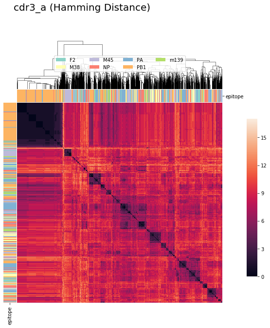
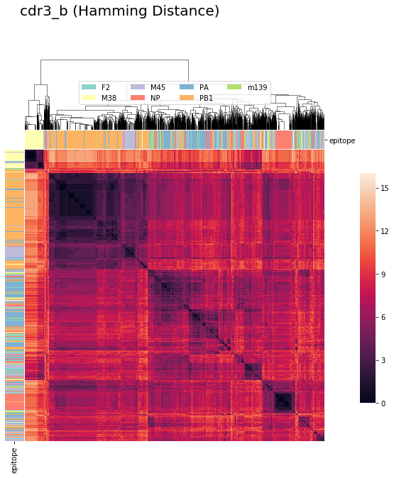
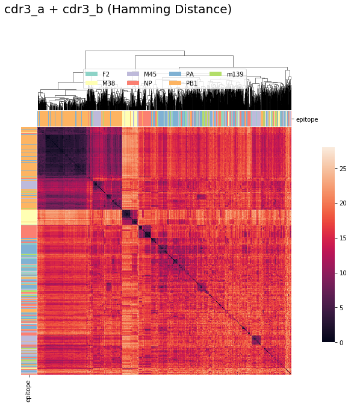
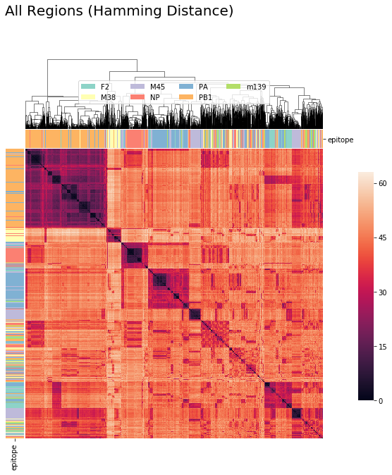
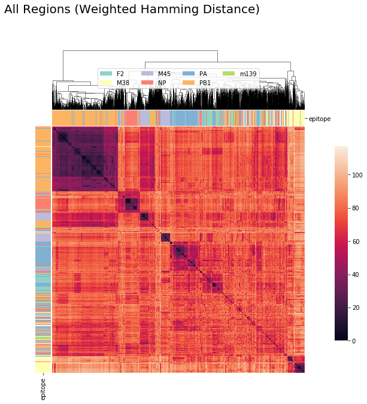
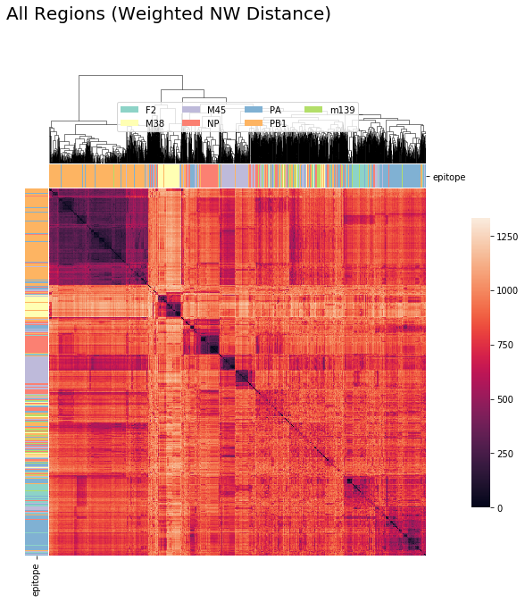
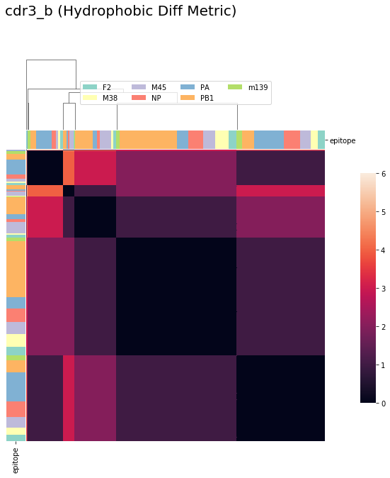

Quick-Start Example
===================

The Quick-Start Example illustrates some of the flexibility of tcrdist2.

See the Detailed Example for similar material with more complete explanations of
the step-wise procedure and TCRrep class.

.. code:: python

    import pandas as pd
    import numpy as np
    import parasail

    import matplotlib
    import matplotlib.pyplot as plt
    import seaborn as sns
    %matplotlib inline

    import tcrdist as td
    from tcrdist import mappers
    from tcrdist.repertoire import TCRrep
    from tcrdist.vis_tools import bostock_cat_colors, cluster_viz

Preliminary Steps
-----------------

Load, Format, and Subset the Data
^^^^^^^^^^^^^^^^^^^^^^^^^^^^^^^^^

.. code:: python

    pd_df = pd.read_csv("vdjDB_PMID28636592.tsv", sep = "\t")       # 1
    t_df = td.mappers.vdjdb_to_tcrdist2(pd_df = pd_df)              # 2
    t_df.organism.value_counts                                      # 3
    index_mus = t_df.organism == "MusMusculus"                      # 4
    t_df_mus = t_df.loc[index_mus,:].copy()                         # 5

1. Read the .tsv data file into a pandas DataFrame.

2. Call tcrdist.mappers.vdjdb_to_tcrdist2() to select and rename the
   appropriate columns.

3. The data has both human and mouse TCRs, which can’t be combined in a
   single repertoire.

4. Index the sequences that come from MusMusculus (mouse).

5. Create a copy of the subset DataFrame t_df, including only mouse
   TCRs: t_df_mus.

tr1 - Initialize the Repertoire
^^^^^^^^^^^^^^^^^^^^^^^^^^^^^^^

.. code:: python

    tr1 = TCRrep(cell_df = t_df_mus, organism = "mouse")             # 6
    tr1.infer_cdrs_from_v_gene(chain = 'alpha')                      # 7
    tr1.infer_cdrs_from_v_gene(chain = 'beta')                       # 8
    tr1.index_cols =['epitope',                                      # 9
                    'subject',
                    'cdr3_a_aa',
                    'cdr1_a_aa',
                    'cdr2_a_aa',
                    'pmhc_a_aa',
                    'cdr3_b_aa',
                    'cdr1_b_aa',
                    'cdr2_b_aa',
                    'pmhc_b_aa']
    tr1.deduplicate()                                                # 10

.. parsed-literal::

    tcrdist.repertoire.TCRrep for <Your TCR Repertoire Project>
     with index_cols: ['epitope', 'subject', 'cdr3_a_aa', 'cdr1_a_aa', 'cdr2_a_aa', 'pmhc_a_aa', 'cdr3_b_aa', 'cdr1_b_aa', 'cdr2_b_aa', 'pmhc_b_aa']
     with model organism: mouse

Detailed explanations of the steps shown above can be found in Example 1

6.  Create an instance of the tcrdist.repertoire.TCRrep class
    initialized with the t_df_mus DataFrame.

7.  Use tcrdist.repertoire.TCRrep.infer_cdrs_from_v_gene() to populate
    CDR1, CDR2 and pMHC loop fields.

8.  Repeat step 7, with chain set to ‘beta’.

9.  Specify index columns. Any sequence identical across all the index
    columns will be grouped at the following step. The count field keeps
    track of the number of identical clones (which may occur during
    clonal expansion)

10. Call tcrdist.repertoire.TCRrep.deduplicate() to remove duplicates
    and create the tcrdist.repertoire.TCRrep.clone_df DataFrame.

Compute Hamming Distance Based Distances
----------------------------------------

.. code:: python

    tr1.compute_pairwise_all(chain = "alpha",                         # 11
                            metric = "hamming",
                            processes = 6,
                            matrix = parasail.blosum62)

    tr1.compute_pairwise_all(chain = "beta",                          # 12
                            metric = "hamming",
                            processes = 6,
                            matrix = parasail.blosum62)

11. with metric argument is set to either ‘hamming’, ‘nw’ or ‘custom’,
    tcrdist2 uses python’s multiprocessing package to parallelize
    pairwise distance computation.

12. Repeat the previous step setting chain argument to ‘beta’.

How to Calculate a tcrdist
--------------------------

Once region based pairwise comparison have been generated with
``compute_pairwise_all( )``, there are two ways to compute a tcrdist
with user defined weights.

**Method 1.** One can simply access individual pairwise matrices after
``compute_pairwise_all( )``. Because the dimensions are row order in
clone_df. Individual pairewise matrices from different regions can be
combined, and weighted:

.. code:: python

   # tcrdist1 = (cdr3_alpha)
     tcrdist1 = tr1.cdr3_a_aa_pw

   # tcrdist2 =  3*(cdr3_alpha)     + 3*(cdr4_beta)
     tcrdist2   =  3 * tr1.cdr3_a_aa_pw  + 3 * trd.cdr3_b_aa_pw

   # tcrdist3   3*(cdr3_alpha)        + 3*(cdr4_beta)        + 1*(cdr1_alpha)       + 1*(cdr1_beta)
     tcrdist3 = 3 * tr1.cdr3_a_aa_pw  + 3 * trd.cdr3_b_aa_pw + 1 * trd.cdr1_a_aa_pw + 1 * trd.cdr1_b_aa_pw

**Method 2.** Alternatively use the builtin function
``.compute_paired_tcrdist( )`` with a dictionary of weights:

.. code:: python

   # tcrdist1
   weights1 =

   {'cdr3_a_aa_pw': 3,'cdr3_b_aa_pw': 0,
    'cdr2_a_aa_pw': 0,'cdr2_b_aa_pw': 0,
    'cdr1_a_aa_pw': 0,'cdr1_b_aa_pw': 0,
    'pmhc_a_aa_pw': 0,'pmhc_b_aa_pw': 0}

   # or
   # tcrdist2
   weights2 =
   {'cdr3_a_aa_pw': 3,'cdr3_b_aa_pw': 3,
    'cdr2_a_aa_pw': 0,'cdr2_b_aa_pw': 0,
    'cdr1_a_aa_pw': 0,'cdr1_b_aa_pw': 0,
    'pmhc_a_aa_pw': 0,'pmhc_b_aa_pw': 0}

   # or
   # tcrdist3
   weights3 =
   {'cdr3_a_aa_pw': 3,'cdr3_b_aa_pw': 0,
    'cdr2_a_aa_pw': 0,'cdr2_b_aa_pw': 0,
    'cdr1_a_aa_pw': 1,'cdr1_b_aa_pw': 1,
    'pmhc_a_aa_pw': 0,'pmhc_b_aa_pw': 0}

   tcrdist1 = tr.compute_paired_tcrdist(replacement_weights = weights1, store_result = True)
   tcrdist2 = tr.compute_paired_tcrdist(replacement_weights = weights2, store_result = True)
   tcrdist3 = tr.compute_paired_tcrdist(replacement_weights = weights3, store_result = True)

When using the builtin method (store_result = True) the tcrdist matrices
and weights can be accessed later:

.. code:: python

   tr.stored_tcrdist[-3]
   tr.stored_tcrdist[-2]
   tr.stored_tcrdist[-1]

Hamming Distance Based tcrdists
-------------------------------

tcrdist : CDR3_alpha (Hamming Distance)
^^^^^^^^^^^^^^^^^^^^^^^^^^^^^^^^^^^^^^^

.. code:: python

    tcrdist1a  = pd.DataFrame(tr1.cdr3_a_aa_pw)
    cluster_viz(tcrdist1a,
                tr1.clone_df,
                tr1.clone_df.epitope.unique(),
                bostock_cat_colors(['set3']),
                "cdr3_a (Hamming Distance)")

.. parsed-literal::

    /Users/kmayerbl/anaconda3/envs/py36/lib/python3.6/site-packages/seaborn/matrix.py:603: ClusterWarning: scipy.cluster: The symmetric non-negative hollow observation matrix looks suspiciously like an uncondensed distance matrix
      metric=self.metric)

tcrdist : CDR3_beta (Hamming Distance)
^^^^^^^^^^^^^^^^^^^^^^^^^^^^^^^^^^^^^^

.. code:: python

    tcrdist1b  = pd.DataFrame(tr1.cdr3_b_aa_pw )
    cluster_viz(tcrdist1b,
                tr1.clone_df,
                tr1.clone_df.epitope.unique(),
                bostock_cat_colors(['set3']),
                "cdr3_b (Hamming Distance)")

tcrdist : CDR3_alpha + CDR3_beta (Hamming Distance)
^^^^^^^^^^^^^^^^^^^^^^^^^^^^^^^^^^^^^^^^^^^^^^^^^^^

.. code:: python

    tcrdist2  = pd.DataFrame(tr1.cdr3_a_aa_pw + tr1.cdr3_b_aa_pw )
    cluster_viz(tcrdist2,
                tr1.clone_df,
                tr1.clone_df.epitope.unique(),
                bostock_cat_colors(['set3']),
                "cdr3_a + cdr3_b (Hamming Distance)")

tcrdist : CDR3_alpha + CDR3_beta + Other CDR Regions (Hamming Distance)
^^^^^^^^^^^^^^^^^^^^^^^^^^^^^^^^^^^^^^^^^^^^^^^^^^^^^^^^^^^^^^^^^^^^^^^

.. code:: python

    tcrdist3 = pd.DataFrame(tr1.compute_paired_tcrdist(store_result= False)['paired_tcrdist'])
    cluster_viz(tcrdist3,
                tr1.clone_df,
                tr1.clone_df.epitope.unique(),
                bostock_cat_colors(['set3']),
                "All Regions (Hamming Distance)")

CDR3_alpha + CDR3_beta + Other CDR Regions (Weighted Hamming Distance)
^^^^^^^^^^^^^^^^^^^^^^^^^^^^^^^^^^^^^^^^^^^^^^^^^^^^^^^^^^^^^^^^^^^^^^

.. code:: python

    tcrdist3w = tr1.compute_paired_tcrdist(store_result= False,
                                         replacement_weights = {'cdr3_a_aa_pw': 3,
                                                                'cdr3_b_aa_pw': 3})
    tcrdist = pd.DataFrame(tcrdist3w['paired_tcrdist'])
    cluster_viz(tcrdist,
                tr1.clone_df,
                tr1.clone_df.epitope.unique(),
                bostock_cat_colors(['set3']),
                "All Regions (Weighted Hamming Distance)")

Substitution Matrix Based Distance Scores
-----------------------------------------

It is at the ``.compute_pairwise_all( )`` step that the choice of
distance metric is specified. When the method is specified as ‘nw’ a
reciprocal alignment score is calculated which is function of the
subsitution matrix used to score the optimal alignment (see more
explanation in example 1).

.. code:: python

    tr1.compute_pairwise_all(chain = "alpha",                         # 11
                            metric = "nw",
                            processes = 6,
                            matrix = parasail.blosum62)

    tr1.compute_pairwise_all(chain = "beta",                          # 12
                            metric = "nw",
                            processes = 6,
                            matrix = parasail.blosum62)

CDR3_alpha + CDR3_beta + Other CDR Regions (Weighted NW Sub Matrix Based Distance)
^^^^^^^^^^^^^^^^^^^^^^^^^^^^^^^^^^^^^^^^^^^^^^^^^^^^^^^^^^^^^^^^^^^^^^^^^^^^^^^^^^

.. code:: python

    tcrdist = tr1.compute_paired_tcrdist(store_result= False,
                                         replacement_weights = {'cdr3_a_aa_pw': 3,
                                                                'cdr3_b_aa_pw': 3})
    tcrdist = pd.DataFrame(tcrdist['paired_tcrdist'])
    cluster_viz(tcrdist,
                tr1.clone_df,
                tr1.clone_df.epitope.unique(),
                bostock_cat_colors(['set3']),
                "All Regions (Weighted NW Distance)")

tcrdist2 Can Parallelize Custom Metrics
---------------------------------------

Suppose you Imagine Some Metric
^^^^^^^^^^^^^^^^^^^^^^^^^^^^^^^

.. code:: python

    def hydrophobic_custom_metric(s1, s2):

        s1 = s1.upper()
        s2 = s2.upper()

        # Types of Amino Acids
        # positive_charged = ["R", "H", "K"]

        # negative_charged = ["D","E"]

        # polar_side_chain = ["S", "T", "N", "Q"]

        # special_cases    = ["C", "U", "G", "P"]

        hydrophobes      = ["A", "I", "L", "M", "W", "Y", "V"]

        # count the number of hydrophobic amino acids in s1
        h1 = np.sum([x in hydrophobes for x in list(s1)])

        # count the number of hydrophobic amino acids in s2
        h2 = np.sum([x in hydrophobes for x in list(s2)])

        # calculate the absolute difference in hydrophobic amino acids
        hydrophobic_absolute_dif = abs(h1-h2)

        return int(hydrophobic_absolute_dif)

It can be passed to ``compute_pairwise_all( )``
^^^^^^^^^^^^^^^^^^^^^^^^^^^^^^^^^^^^^^^^^^^^^^^

.. code:: python

    tr1.compute_pairwise_all(chain = "alpha",                          # 12
                             metric = "custom", # <----------- set metric to custom
                             processes = 6,
                             user_function = hydrophobic_custom_metric) # <----------- supply your custom function

    tr1.compute_pairwise_all(chain = "beta",                          # 12
                             metric = "custom", # <----------- set metric to custom
                             processes = 6,
                             user_function = hydrophobic_custom_metric) # <----------- supply your custom function

.. code:: python

    tcrdist  = pd.DataFrame(tr1.cdr3_b_aa_pw)
    cluster_viz(tcrdist,
                tr1.clone_df,
                tr1.clone_df.epitope.unique(),
                bostock_cat_colors(['set3']),
                "cdr3_b (Hydrophobic Diff Metric)")

.. code:: python

    tcrdist  = pd.DataFrame(tr1.cdr3_a_aa_pw)
    cluster_viz(tcrdist,
                tr1.clone_df,
                tr1.clone_df.epitope.unique(),
                bostock_cat_colors(['set3']),
                "cdr3_a (Hydrophobic Diff Metric)")
