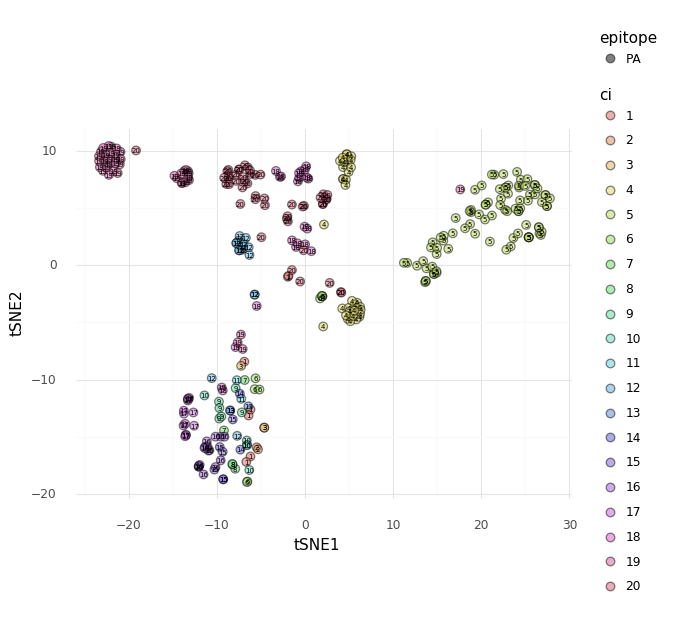
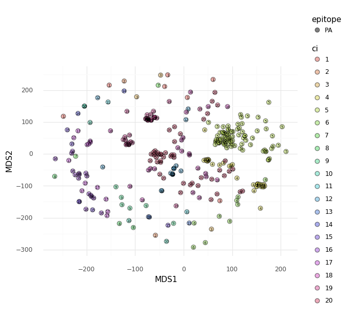
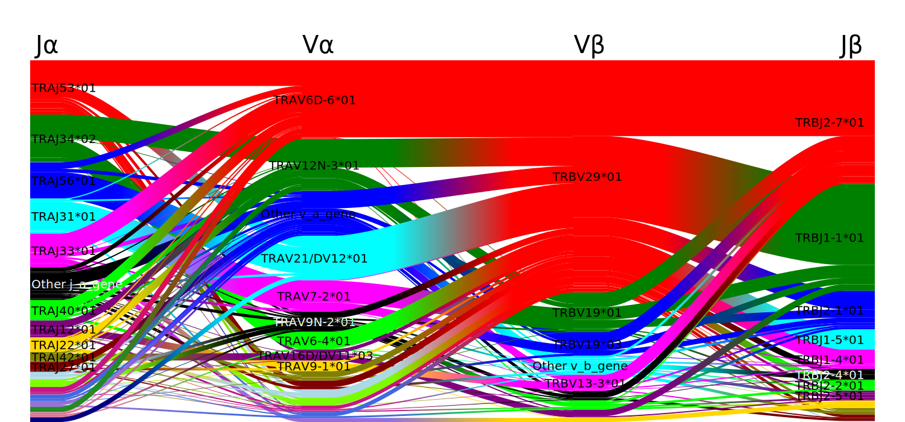
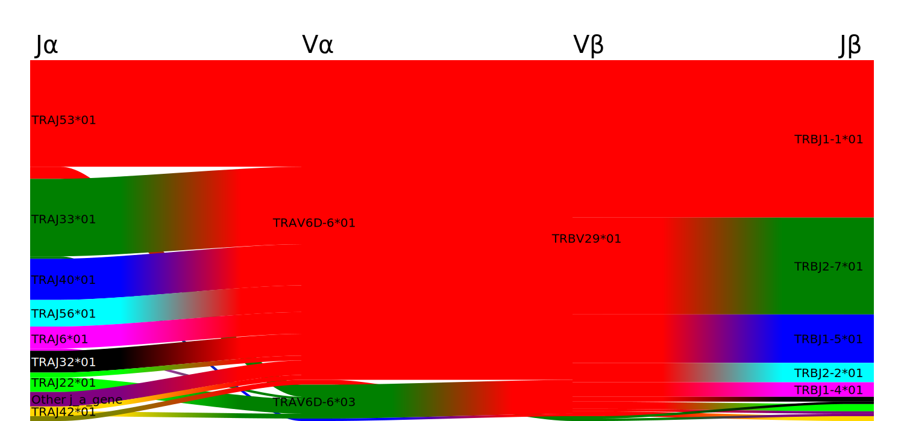
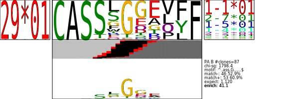

.. _HotStart:

Hot Start Vignette
==================

Imports
-------

.. code:: python

    # basic imports
    import os
    import pandas as pd
    import numpy as np
    import IPython
    
    # tcrdist classes
    from tcrdist.repertoire import TCRrep
    from tcrdist.subset import TCRsubset
    from tcrdist.cdr3_motif import TCRMotif
    from tcrdist.storage import StoreIOMotif, StoreIOEntropy
    
    # tcrdist functions
    from tcrdist import plotting
    from tcrdist.mappers import populate_legacy_fields
    
    # scipy functions for clustering
    from scipy.spatial import distance    
    from scipy.cluster.hierarchy import linkage, dendrogram, fcluster 
    
    # sklearn functions for low-dimensional embeddings 
    from sklearn.manifold import TSNE, MDS
    
    # plotnine to allow grammar of graphics plotting akin to R's ggplot2
    import plotnine as gg

``TCRrep``
----------

Download repertoire data: (`dash.csv <https://raw.githubusercontent.com/kmayerb/tcrdist2/API2/tcrdist/test_files_compact/dash.csv>`_ 375KB). 

+-------------------+---------+-------+---------------------+-----------+--------------------+--------------------------------------------------------+-------------+------------+--------------------+--------------------------------------------------------+---------------------+
| subject           | epitope | count | v_a_gene            | j_a_gene  | cdr3_a_aa          | cdr3_a_nucseq                                          | v_b_gene    | j_b_gene   | cdr3_b_aa          | cdr3_b_nucseq                                          | clone_id            |
+===================+=========+=======+=====================+===========+====================+========================================================+=============+============+====================+========================================================+=====================+
| mouse_subject0050 | PA      | 2     | TRAV7-3*01          | TRAJ33*01 | CAVSLDSNYQLIW      | tgtgcagtgagcctcgatagcaactatcagttgatctgg                | TRBV13-1*01 | TRBJ2-3*01 | CASSDFDWGGDAETLYF  | tgtgccagcagtgatttcgactggggaggggatgcagaaacgctgtatttt    | mouse_tcr0072.clone |
+-------------------+---------+-------+---------------------+-----------+--------------------+--------------------------------------------------------+-------------+------------+--------------------+--------------------------------------------------------+---------------------+
| mouse_subject0050 | PA      | 6     | TRAV6D-6*01         | TRAJ56*01 | CALGDRATGGNNKLTF   | tgtgctctgggtgacagggctactggaggcaataataagctgactttt       | TRBV29*01   | TRBJ1-1*01 | CASSPDRGEVFF       | tgtgctagcagtccggacaggggtgaagtcttcttt                   | mouse_tcr0096.clone |
+-------------------+---------+-------+---------------------+-----------+--------------------+--------------------------------------------------------+-------------+------------+--------------------+--------------------------------------------------------+---------------------+
| mouse_subject0050 | PA      | 1     | TRAV6D-6*01         | TRAJ49*01 | CALGSNTGYQNFYF     | tgtgctctgggctcgaacacgggttaccagaacttctatttt             | TRBV29*01   | TRBJ1-5*01 | CASTGGGAPLF        | tgtgctagcacagggggaggggctccgcttttt                      | mouse_tcr0276.clone |
+-------------------+---------+-------+---------------------+-----------+--------------------+--------------------------------------------------------+-------------+------------+--------------------+--------------------------------------------------------+---------------------+

Calculate pairwise TCR distances between all clones in the repertoire.

.. code:: python

    #1 load data, subset to receptors recognizing "PA" epitope
    tcrdist2_df = pd.read_csv(os.path.join("dash.csv"))
    tcrdist2_df = tcrdist2_df[tcrdist2_df.epitope == "PA"].copy()
    
    #2 create instance of TCRrep class, initializes input as tr.cell_df attribute
    tr = TCRrep(cell_df = tcrdist2_df, chains = ['alpha','beta'],organism = "mouse")
    
    #3 Infer CDR1,CDR2,CDR2.5 (a.k.a. phmc) from germline v-genes
    tr.infer_cdrs_from_v_gene(chain = 'alpha', imgt_aligned=True)
    tr.infer_cdrs_from_v_gene(chain = 'beta',  imgt_aligned=True)
    
    #4 Define index columns for determining unique clones.
    tr.index_cols = ['clone_id', 'subject', 'epitope',
                    'v_a_gene',  'j_a_gene', 'v_b_gene', 'j_b_gene',
                    'cdr3_a_aa', 'cdr3_b_aa',
                    'cdr1_a_aa', 'cdr2_a_aa', 'pmhc_a_aa',
                    'cdr1_b_aa', 'cdr2_b_aa', 'pmhc_b_aa',
                    'cdr3_b_nucseq', 'cdr3_a_nucseq']
    
    #4 Deduplicate based on index cols, creating tr.clone_df attribute
    tr.deduplicate()
    
    #5 calculate tcrdists by method in Dash et al. 
    tr._tcrdist_legacy_method_alpha_beta()
    
    #6 Check that sum of alpah-chain and beta-chain distance matrices equal paired_tcrdist
    distA = tr.dist_a
    distB = tr.dist_b
    assert np.all(((distA + distB) - tr.paired_tcrdist) == 0)

Hier. Cluster TCR-Distances
---------------------------

The pairwise TCR distance matrix calculated by
``tcrdist2.repertoire.TCRrep`` (i.e., accessible as ``tr.paired_tcrdist``) can serve
as the input for ``scipy.cluster.hierarchy`` tools or your preferred python
library for unsupervised clustering of sequences within the repertoire.
The rows of ``tr.clone_df`` match the order of rows in
``tr.paired_distance``. Thus, any ``cluster_index`` you produce, must
match length and order of ``tr.clone_df``.

.. code:: python

    from scipy.spatial import distance    
    from scipy.cluster.hierarchy import linkage, dendrogram, fcluster 
    compressed_dmat = distance.squareform(tr.paired_tcrdist, force = "vector")
    Z = linkage(compressed_dmat, method = "complete")
    den = dendrogram(Z, color_threshold = np.inf, no_plot = True)
    cluster_index = fcluster(Z, t = 20, criterion = "maxclust")
    assert len(cluster_index) == tr.clone_df.shape[0]
    assert len(cluster_index) == tr.paired_tcrdist.shape[0]
    tr.clone_df['cluster_index'] = cluster_index

2D Embeddings
-------------

The pairwise TCR distance matrix calculated by
``tcrdist2.repertoire.TCRrep`` (i.e., accessible as ``tr.paired_tcrdist``) can be used
as input for embedding the pairwise dissimilarity matrix in fewer dimensions. 
Here we provide an example using ``sklearn`` to perform tSNE and MDS.

.. code:: python

    import numpy as np
    from sklearn.manifold import TSNE, MDS
    X = tr.paired_tcrdist
    X_embedded = TSNE(n_components=2).fit_transform(X)
    
    tsne_df = pd.DataFrame(X_embedded, columns = ["tSNE1","tSNE2"])
    tsne_df['ci'] = cluster_index
    tsne_df['ci'] = tsne_df['ci'].astype('category')
    tsne_df['epitope'] = tr.clone_df.epitope.astype('category')
    
    X_embedded_mds = MDS(n_components=2, dissimilarity='precomputed').fit_transform(X)
    mds_df = pd.DataFrame(X_embedded_mds, columns = ["MDS1","MDS2"])
    mds_df['ci'] = cluster_index
    mds_df['ci'] = mds_df['ci'].astype('category')
    mds_df['epitope'] = tr.clone_df.epitope.astype('category')

.. code:: python

    def gg_embed_plot(df,
                      xvar = 'tSNE1', 
                      yvar = 'tSNE2'):
        """
        Function for plotting embedding using plotnine
        
        Parameters
        ----------
        df   : pandas.DataFrame
        xvar : str
            column with data to be plotted along the x-axis
        yvar : str
            column with data to be plotted along the y-axis 
        
        Returns
        -------
        gg_em_plot : plotnine.ggplot.ggplot
        
        """
        import plotnine as gg
    
        gg_em_plt = ( gg.ggplot(df) 
                    + gg.aes(x = xvar, 
                             y = yvar, 
                             col = "ci", 
                             label = 'ci', 
                             fill = "ci", 
                             shape = "epitope")
                    + gg.geom_point(size = 3, alpha = .5)
                    + gg.geom_text(size = 5)
                    + gg.theme_minimal())
        
        return(gg_em_plt)
        

tSNE
~~~~

.. code:: python

    gg_embed_plot(df = tsne_df, xvar = "tSNE1", yvar="tSNE2")

MDS
~~~

.. code:: python

    gg_embed_plot(df = mds_df, xvar = "MDS1", yvar="MDS2")

``TCRsubset``
-------------

Consider cluster 5 of the PA-reactive repertoire in the plot above. Using tcrdist2 we can search 
for motifs in any portion of the repertoire by specifying a criteria and initializing
``TCRsubset`` with a subset of the data as shown below.

.. code:: python

    # define a logical criteria
    criteria = (cluster_index == 5) 
    
    # subset the TCRrep clone DataFrame to only those sequences meeting that criteria
    clone_df_subset = tr.clone_df[criteria]
    clone_df_subset = clone_df_subset[clone_df_subset.epitope == "PA"].copy()
    
    # subset the alpha chain and beta chain distance matrices using the `clone_df_subset.clone_id` index
    dist_a_subset = tr.dist_a.loc[clone_df_subset.clone_id, clone_df_subset.clone_id].copy()
    dist_b_subset = tr.dist_b.loc[clone_df_subset.clone_id, clone_df_subset.clone_id].copy()
    
    # use the populate_legacy_fields function to add some columns needed for compatability with tcrdist1
    clone_df_subset = populate_legacy_fields(df = clone_df_subset, chains =['alpha', 'beta'])
    
    # initialize an instance of the TCRsubset class.
    ts = TCRsubset(clone_df_subset,
                organism = "mouse",
                epitopes = ["PA"] ,
                epitope = "PA",
                chains = ["A","B"],
                dist_a = dist_a_subset,
                dist_b = dist_b_subset)

.. parsed-literal::

    read 169087 A-chains from /Users/kmayerbl/TCRDIST/tcrdist2/tcrdist/db/alphabeta_db.tsv_files/new_nextgen_chains_mouse_A.tsv
    read 1947545 B-chains from /Users/kmayerbl/TCRDIST/tcrdist2/tcrdist/db/alphabeta_db.tsv_files/new_nextgen_chains_mouse_B.tsv

Plot Gene Usage
---------------

Gene Usage in the Repertoire
~~~~~~~~~~~~~~~~~~~~~~~~~~~~

Consider the gene usage of the whole PA-reactive repertoire.

.. code:: python

    from tcrdist import plotting
    gene_usage_repertoire_svg = plotting.plot_pairings(cell_df = tr.clone_df,
                                            cols = ['j_a_gene', 
                                                    'v_a_gene',
                                                    'v_b_gene', 
                                                    'j_b_gene'],
                                            count_col='count')

.. code:: python

    IPython.display.SVG(data=gene_usage_repertoire_svg)

Gene Usage in the Subset
~~~~~~~~~~~~~~~~~~~~~~~~

Consider the gene usage in cluster 5 of the PA-reactive repertoire.

.. code:: python

    gene_usage_subset_svg = plotting.plot_pairings(cell_df = ts.clone_df,
                                            cols = ['j_a_gene', 
                                                    'v_a_gene',
                                                    'v_b_gene', 
                                                    'j_b_gene'],
                                            count_col='count')
    
    IPython.display.SVG(data=gene_usage_subset_svg)

Discover Motifs
---------------

This process may take a few minutes depending on the size of the cluster selected.

.. code:: python

    if os.path.isfile("dash_PA_cluster_5_motifs.csv"):
        ts.motif_df = pd.read_csv("dash_PA_cluster_5_motifs.csv")
    else:
        motif_df = ts.find_motif()

Save Discovered Motifs
~~~~~~~~~~~~~~~~~~~~~~

.. code:: python

    ts.motif_df.to_csv("dash_PA_cluster_5_motifs.csv", index = False)

Plot Motifs
-----------

.. code:: python

    motif_list_a = list()
    motif_logos_a = list()
    for i,row in ts.motif_df[ts.motif_df.ab == "A"].iterrows():
        StoreIOMotif_instance = ts.eval_motif(row)
        motif_list_a.append(StoreIOMotif_instance)
        motif_logos_a.append(plotting.plot_pwm(StoreIOMotif_instance, create_file = False, my_height = 200, my_width = 600))
            
    motif_list_b = list()
    motif_logos_b = list()
    for i,row in ts.motif_df[ts.motif_df.ab == "B"].iterrows():
        StoreIOMotif_instance = ts.eval_motif(row)
        motif_list_b.append(StoreIOMotif_instance)
        motif_logos_b.append(plotting.plot_pwm(StoreIOMotif_instance, create_file = False, my_height = 200, my_width = 600))

Top Alpha-Chain Motif
~~~~~~~~~~~~~~~~~~~~~

You can visualize the ith motifs by changing the index `[0]` to `[i]` in the code below.

.. code:: python

    IPython.display.SVG(motif_logos_a[0])

Top Beta-Chain Motif
~~~~~~~~~~~~~~~~~~~~

.. code:: python

    IPython.display.SVG(motif_logos_b[0])

All Code in One Block
---------------------

.. code:: python

    # All code in one block, minus plotting.

    # basic imports
    import os
    import pandas as pd
    import numpy as np
    import IPython

    # tcrdist classes
    from tcrdist.repertoire import TCRrep
    from tcrdist.subset import TCRsubset
    from tcrdist.cdr3_motif import TCRMotif
    from tcrdist.storage import StoreIOMotif, StoreIOEntropy

    # tcrdist functions
    from tcrdist import plotting
    from tcrdist.mappers import populate_legacy_fields

    # scipy functions for clustering
    from scipy.spatial import distance    
    from scipy.cluster.hierarchy import linkage, dendrogram, fcluster 

    # sklearn functions for low-dimensional embeddings 
    from sklearn.manifold import TSNE, MDS

    # plotnine to allow grammar of graphics plotting akin to R's ggplot2
    import plotnine as gg

    #1 load data, subset to receptors recognizing "PA" epitope
    tcrdist2_df = pd.read_csv(os.path.join("tcrdist",""test_files_compact","dash.csv"))
    tcrdist2_df = tcrdist2_df[tcrdist2_df.epitope == "PA"].copy()

    #2 create instance of TCRrep class, initializes input as tr.cell_df attribute
    tr = TCRrep(cell_df = tcrdist2_df, chains = ['alpha','beta'],organism = "mouse")

    #3 Infer CDR1,CDR2,CDR2.5 (a.k.a. phmc) from germline v-genes
    tr.infer_cdrs_from_v_gene(chain = 'alpha', imgt_aligned=True)
    tr.infer_cdrs_from_v_gene(chain = 'beta',  imgt_aligned=True)

    #4 Define index columns for determining unique clones.
    tr.index_cols = ['clone_id', 'subject', 'epitope',
                    'v_a_gene',  'j_a_gene', 'v_b_gene', 'j_b_gene',
                    'cdr3_a_aa', 'cdr3_b_aa',
                    'cdr1_a_aa', 'cdr2_a_aa', 'pmhc_a_aa',
                    'cdr1_b_aa', 'cdr2_b_aa', 'pmhc_b_aa',
                    'cdr3_b_nucseq', 'cdr3_a_nucseq']

    #4 Deduplicate based on index cols, creating tr.clone_df attribute
    tr.deduplicate()

    #5 calculate tcrdists by method in Dash et al. 
    tr._tcrdist_legacy_method_alpha_beta()

    #6 Check that sum of alpah-chain and beta-chain distance matrices equal paired_tcrdist
    distA = tr.dist_a
    distB = tr.dist_b
    assert np.all(((distA + distB) - tr.paired_tcrdist) == 0)

    # Cluster
    from scipy.spatial import distance    
    from scipy.cluster.hierarchy import linkage, dendrogram, fcluster 
    compressed_dmat = distance.squareform(tr.paired_tcrdist, force = "vector")
    Z = linkage(compressed_dmat, method = "complete")
    den = dendrogram(Z, color_threshold = np.inf, no_plot = True)
    cluster_index = fcluster(Z, t = 20, criterion = "maxclust")
    assert len(cluster_index) == tr.clone_df.shape[0]
    assert len(cluster_index) == tr.paired_tcrdist.shape[0]
    tr.clone_df['cluster_index'] = cluster_index

    # Subset to Cluster 5
    criteria = (cluster_index == 5) 
    clone_df_subset = tr.clone_df[criteria]
    clone_df_subset = clone_df_subset[clone_df_subset.epitope == "PA"].copy()
    dist_a_subset = tr.dist_a.loc[clone_df_subset.clone_id, clone_df_subset.clone_id].copy()
    dist_b_subset = tr.dist_b.loc[clone_df_subset.clone_id, clone_df_subset.clone_id].copy()

    clone_df_subset = populate_legacy_fields(df = clone_df_subset, chains =['alpha', 'beta'])

    ts = TCRsubset(clone_df_subset,
                organism = "mouse",
                epitopes = ["PA"] ,
                epitope = "PA",
                chains = ["A","B"],
                dist_a = dist_a_subset,
                dist_b = dist_b_subset)

    # Find Motifs 
    if os.path.isfile("dash_PA_cluster_5_motifs.csv"):
        ts.motif_df = pd.read_csv("dash_PA_cluster_5_motifs.csv")
    else:
        motif_df = ts.find_motif()

    # Save Motifs
    ts.motif_df.to_csv("dash_PA_cluster_5_motifs.csv", index = False)

    # Preprocess Motifs 
    motif_list_a = list()
    motif_logos_a = list()
    for i,row in ts.motif_df[ts.motif_df.ab == "A"].iterrows():
        StoreIOMotif_instance = ts.eval_motif(row)
        motif_list_a.append(StoreIOMotif_instance)
        motif_logos_a.append(plotting.plot_pwm(StoreIOMotif_instance, create_file = False, my_height = 200, my_width = 600))
            
    motif_list_b = list()
    motif_logos_b = list()
    for i,row in ts.motif_df[ts.motif_df.ab == "B"].iterrows():
        StoreIOMotif_instance = ts.eval_motif(row)
        motif_list_b.append(StoreIOMotif_instance)
        motif_logos_b.append(plotting.plot_pwm(StoreIOMotif_instance, create_file = False, my_height = 200, my_width = 600))

