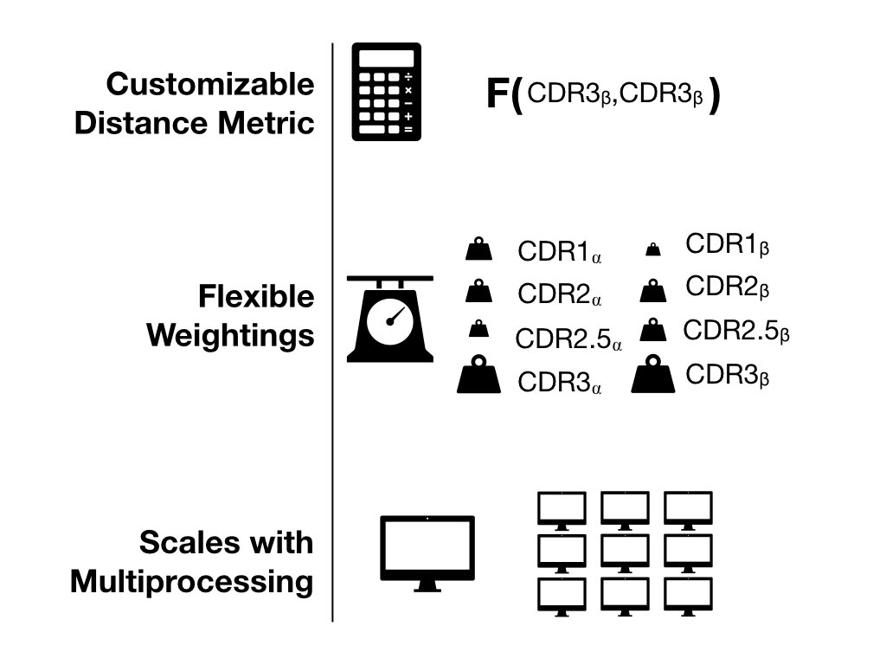
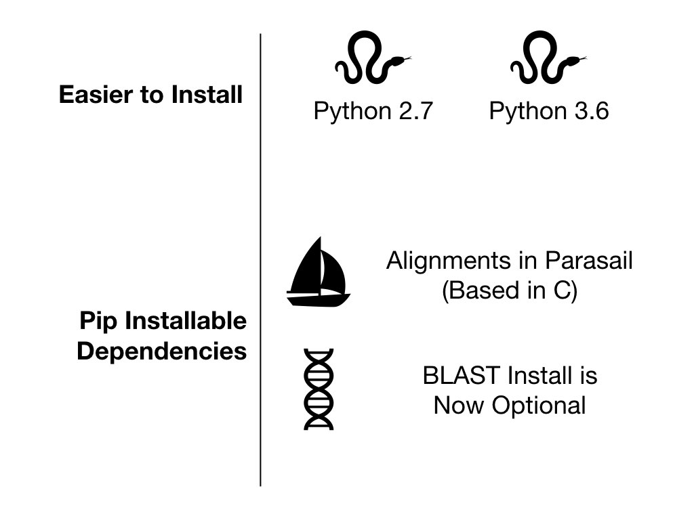
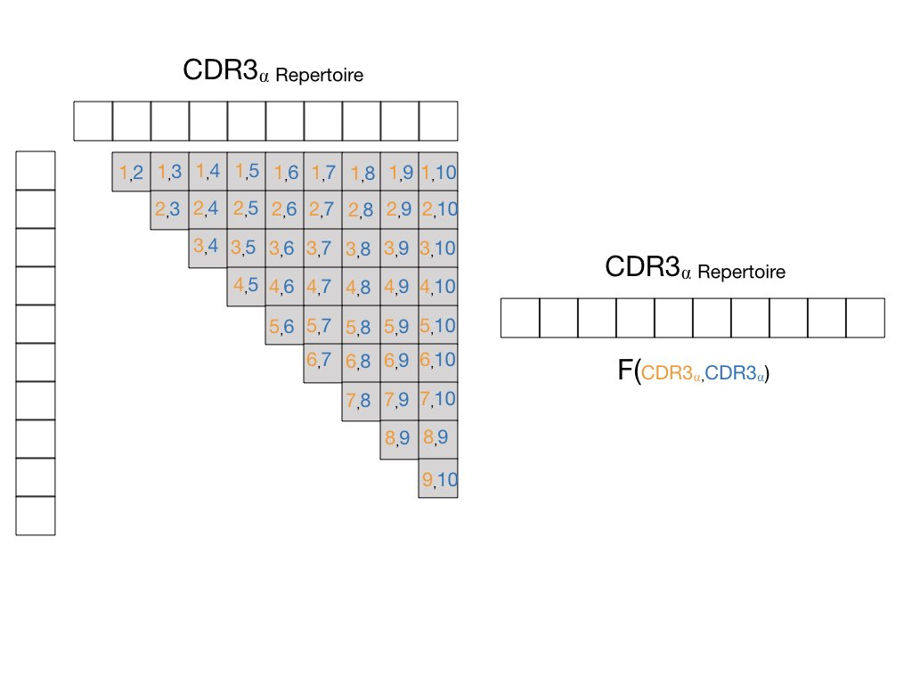

What is New
===========

`tcrdist2 <https://github.com/kmayerb/tcrdist2>`_ is a python
API-enabled toolkit expanding on the T cell receptor analysis pipeline
developed by Phillip Harlan Bradley, Jeremy Chase Crawford, and
colleagues as part of a T-cell receptor epitope specificity analysis
in Dash et al. Nature (2017). The manuscript
(`doi:10.1038/nature22383 <https://www.nature.com/articles/nature22383>`_)
outlines a basis for T cell receptor comparison by
incorporating dissimilarity across multiple complementarity determining regions.

tcrdist2 builds upon the original TCRdist pipeline in a number of regards. 

New Features
------------

Multiprocessing
---------------

tcrdist2 breaks up pairwise comparison by passing

#. the unique receptor repertoire,
#. {i,j} indices, and
#. the user specified distance metric

to parallel python interpreters using the `multiprocessing package <https://docs.python.org/2/library/multiprocessing.html#module-multiprocessing>`_ .

.. image:: VE4.jpeg
